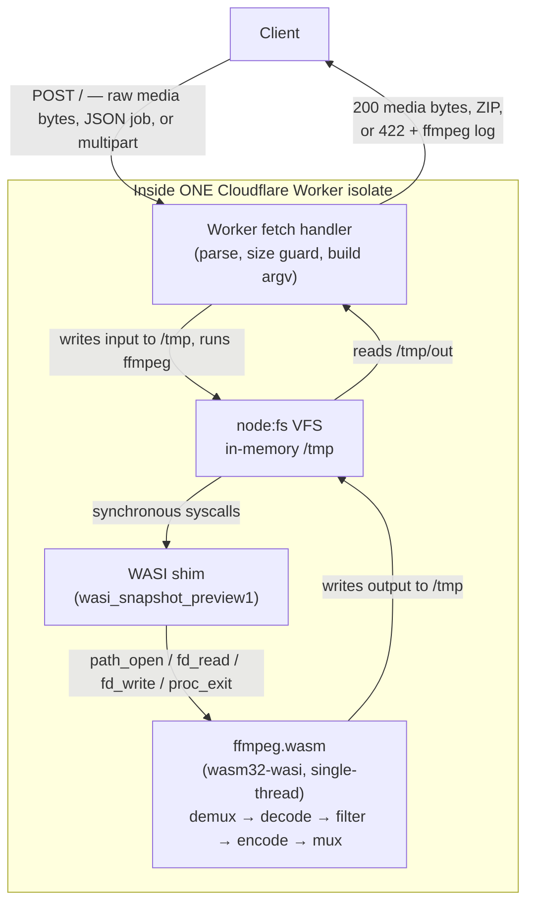
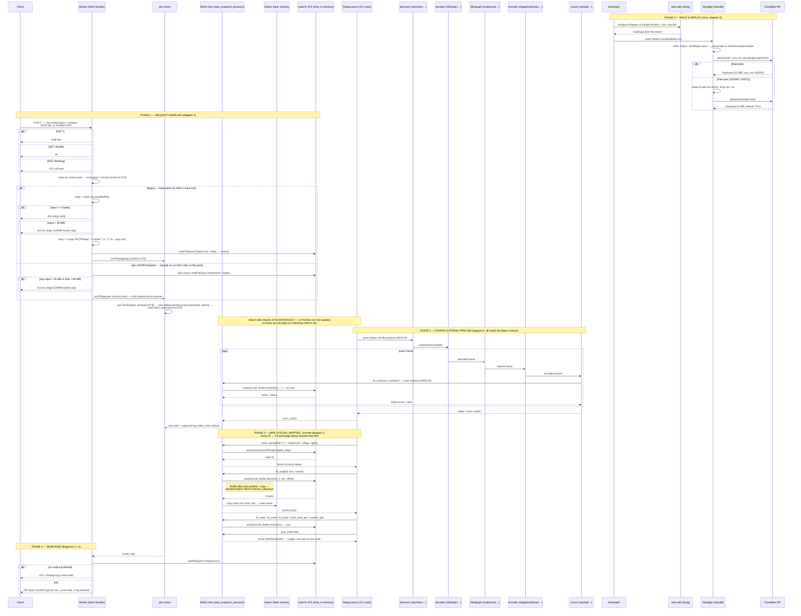

# ffmpeg-workers

A general FFmpeg HTTP API that executes entirely inside a single Cloudflare worker isolate(no third-party services nor other Cloudflare services)

Send a media file the worker runs `ffmpeg` (compiled to `wasm32-wasi`) against an in-memory `/tmp`, and returns the output

Brief info of how it works
1. A media file arrives as a POST - raw bytes, multipart, or a JSON job spec
2. The worker writes it to the in-memory /tmp virtual filesystem and builds the ffmpeg argv
3. ffmpeg runs as a single-threaded wasm32-wasi command module (--disable-pthreads, the ≥6.1 CLI needs threads Workers lacks)
4. It's statically imported, so Wrangler precompiles it to a WebAssembly. Module at deploy time, runtime compilation is blocked by the embedder
5. Workers node:wasi is a throwing stub, so we wrote our own synchronous wasi_snapshot_preview1 shim over node:fs
6. Wasm calls its imports synchronously, so every syscall ffmpeg makes (path_open, fd_read, fd_write, …) maps 1:1 to a blocking openSync/readSync/writeSync(an async shim or JSPI is impossible ig)
7. workerd rejects reads/writes against Wasm-memory subarrays, so the shim copies every slice into a standalone Buffer first
8. A fresh WASI instance starts, and inside the module ffmpeg demuxes /tmp/in, decodes, runs the filtergraph (scale, overlay, …), re-encodes, and muxes /tmp/out
9. The Worker reads /tmp/out back and streams it to the client with x-exit-code and x-log headers
10. Input, output, and the ffmpeg heap all share one 128 MB isolate, so inputs are guarded at 30 MB each / 80 MB per job
11. The WASI sandbox has no network, so the Worker layer fetch()es inputs[].url before ffmpeg runs and PUTs results to outputUrl after
12. Multi-file outputs (frames, HLS segments) come back as a ZIP, two-pass works via runs[] sequential ffmpeg commands sharing the same /tmp
13. Deploy is plan-aware: scripts/deploy.sh tries the full build (6.16 MB gzip, libx264, cpu_ms=300000 via wrangler.paid.toml) and falls back to the trimmed build (1.54 MB gzip, 3 MiB Free cap) when Cloudflare rejects it
## Architecture Diagram

### In depth Protocol Flow

  
## Usage
#### Simple mode (raw body)
Body = media bytes; `x-ffmpeg-args` is spliced between the input and the output of the argv (`-i /tmp/in.ext …args… /tmp/out.ext`). Responses carry `x-exit-code` and `x-log` (base64) headers
```bash
# Transcode: scale + re-encode the uploaded clip
curl -X POST -H 'x-ffmpeg-args:["-vf","scale=160:-2","-c:v","mpeg4","-q:v","5","-an"]' \
--data-binary @clip.mp4 <WORKERS_URL> -o out.mp4

# Full argv control: x-argv overrides the wrapping (paths must stay under /tmp)
curl -X POST -H 'x-argv:["ffmpeg","-nostdin","-y","-i","/tmp/in.mp4","-c:v","mpeg4","-an","/tmp/out.mp4"]' \
--data-binary @clip.mp4 <WORKERS_URL> -o out.mp4

# Network input: worker fetches the source instead of reading the body
curl -X POST -H 'x-input-url: https://example.com/clip.mp4' <WORKERS_URL> -o out.mp4

# Help text, liveness, VFS self-test
curl <WORKERS_URL>/
curl <WORKERS_URL>/health
curl <WORKERS_URL>/fsdebug
```
`x-in-ext` / `x-out-ext` set the `/tmp/in.*` / `/tmp/out.*` extensions (default `mp4`)
#### Job mode (`Content-Type: application/json`)
`inputs` land in `/tmp` (fetched from `url`, decoded from `b64`), `run` /`runs` are the ffmpeg commands; `outputs` names the files to return
```bash
# Remote input + watermark overlay, result streamed back
curl -X POST -H 'content-type: application/json' <WORKERS_URL> -o out.mp4 -d '{
"inputs": [ {"name":"in.mp4","url":"https://example.com/clip.mp4"},
{"name":"logo.png","b64":"<base64 PNG>"} ],
"run": ["-i","/tmp/in.mp4","-i","/tmp/logo.png","-t","1",
"-filter_complex","[0:v]scale=240:-2[v];[v][1:v]overlay=10:10",
"-c:v","mpeg4","-q:v","5","-an","/tmp/out.mp4"],
"outputs": ["/tmp/out.mp4"]
}'

# Two-pass encode: sequential runs share /tmp (keep the passlog under /tmp)
curl -X POST -H 'content-type: application/json' <WORKERS_URL> -o out.mp4 -d '{
"inputs": [ {"name":"in.mp4","url":"https://example.com/clip.mp4"} ],
"runs": [
["-y","-i","/tmp/in.mp4","-c:v","mpeg4","-b:v","300k","-passlogfile","/tmp/pass","-pass","1","-an","-f","null","-"],
["-y","-i","/tmp/in.mp4","-c:v","mpeg4","-b:v","300k","-passlogfile","/tmp/pass","-pass","2","-an","/tmp/out.mp4"]
],
"outputs": ["/tmp/out.mp4"]
}'

# Frame extraction: many outputs come back as a ZIP (x-files lists the entries)
curl -X POST -H 'content-type: application/json' <WORKERS_URL> -o frames.zip -d '{
"inputs": [ {"name":"in.mp4","url":"https://example.com/clip.mp4"} ],
"run": ["-i","/tmp/in.mp4","-t","1","-vf","fps=5,scale=160:-2","/tmp/frames/f%03d.png"],
"outputs": ["/tmp/frames/"]
}'

# Remote output: PUT the result to an outputUrl instead of returning it
curl -X POST -H 'content-type: application/json' <WORKERS_URL> -d '{
"inputs": [ {"name":"in.mp4","url":"https://example.com/clip.mp4"} ],
"run": ["-i","/tmp/in.mp4","-c:v","mpeg4","-q:v","5","-an","/tmp/out.mp4"],
"outputs": ["/tmp/out.mp4"],
"outputUrl": "https://example.com/upload/out.mp4"
}'
```
#### Job mode (`multipart/form-data`)
File parts avoid base64 bloat: the field **name** becomes the `/tmp` filename, `run` / `runs` / `outputs` / `outputUrl` travel as text fields
```bash
# Upload the clip as a file part + the job as a text field
curl -X POST <WORKERS_URL> -o out.mp4 \
-F 'in.mp4=@clip.mp4;type=video/mp4' \
-F 'run=["-i","/tmp/in.mp4","-vf","scale=160:-2","-c:v","mpeg4","-q:v","5","-an","/tmp/out.mp4"]' \
-F 'outputs=["/tmp/out.mp4"]'
```
All paths must live under `/tmp`. One output file → returned raw with a content-type by extension; many → a single `application/zip` (`x-files` lists the entries)
## Develop
```bash
pnpm install
pnpm build:ffmpeg # cross-compile ffmpeg -> build/app.{full,min}.wasm (needs toolchain/wasi-sdk)
pnpm test:node # fast WASI-shim logic check in Node (uses the checked-in test/prog.wasm, no toolchain)
pnpm test # vitest: codec matrix + job API + zip, ffprobe-validated
pnpm test:features # job API (remote in/out, multi-file, zip, two-pass) in Miniflare
pnpm dev # wrangler dev (workerd) on :8787
pnpm test:e2e # end-to-end transcode against wrangler dev
pnpm deploy # deploy
```
